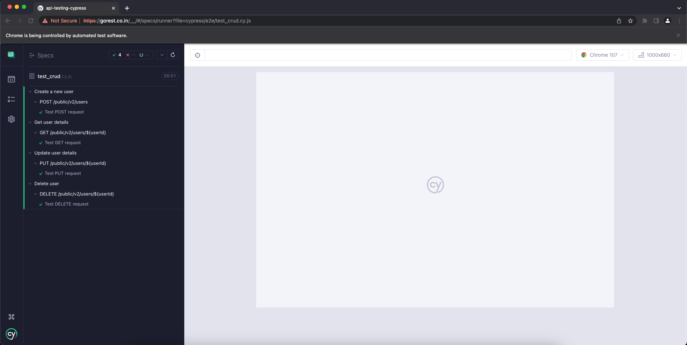

# Cypress REST API Test Framework

REST API Testing with `Cypress`

## 🚀 Description:

Automated CRUD (i.e., `POST`, `GET`, `PUT`, `DELETE`) operations using `Cypress`

## 🚀 Prerequisites:

- `Node.js` and `npm`, https://www.npmjs.com/get-npm explains what are these and how to install them
- `Cypress`
- For testing, will be using Go Rest APIs, https://gorest.co.in

## 🚀 Installation Steps:

- Fork the repository `api-testing-cypress`
- Clone the repository via HTTPS `git clone https://github.com/<your_github_username>/api-testing-cypress.git` or via SSH `git clone git@github.com:<your_github_username>/api-testing-cypress.git`
- Move to the `api-testing-cypress` directory
- Setup a new npm package: `npm init`
- Install cypress: `npm i cypress`
- Add the following lines to the `package.json` file, `"scripts"` section:

```
  "scripts": {
    "cypress:open": "./node_modules/.bin/cypress open",
    "cypress:run": "./node_modules/.bin/cypress run --spec **/*.cy.js"
  }
```

- The `package.json` will look like this:


## 🚀 Test Execution:

- To run the tests on your terminal, run `npm run cypress:run`.

Sample output:

```
% npm run cypress:run

> api-testing-cypress@1.0.0 cypress:run
> ./node_modules/.bin/cypress run --spec **/*.cy.js


====================================================================================================

  (Run Starting)

  ┌────────────────────────────────────────────────────────────────────────────────────────────────┐
  │ Cypress:        11.2.0                                                                         │
  │ Browser:        Electron 106 (headless)                                                        │
  │ Node Version:   v19.0.1 (/opt/homebrew/Cellar/node/19.0.1/bin/node)                            │
  │ Specs:          1 found (test_crud.cy.js)                                                      │
  │ Searched:       **/*.cy.js                                                                     │
  └────────────────────────────────────────────────────────────────────────────────────────────────┘


────────────────────────────────────────────────────────────────────────────────────────────────────

  Running:  test_crud.cy.js                                                                 (1 of 1)


  Create a new user
    POST /public/v2/users
Created a new user with id: 6499

      ✓ Test POST request (1773ms)

  Get user details
    GET /public/v2/users/${userId}
Retrieved user with id: 6499

      ✓ Test GET request (463ms)

  Update user details
    PUT /public/v2/users/${userId}
Updated user with id: 6499

      ✓ Test PUT request (456ms)

  Delete user
    DELETE /public/v2/users/${userId}
Deleted user with id: 6499

      ✓ Test DELETE request (495ms)


  4 passing (3s)


  (Results)

  ┌────────────────────────────────────────────────────────────────────────────────────────────────┐
  │ Tests:        4                                                                                │
  │ Passing:      4                                                                                │
  │ Failing:      0                                                                                │
  │ Pending:      0                                                                                │
  │ Skipped:      0                                                                                │
  │ Screenshots:  0                                                                                │
  │ Video:        true                                                                             │
  │ Duration:     3 seconds                                                                        │
  │ Spec Ran:     test_crud.cy.js                                                                  │
  └────────────────────────────────────────────────────────────────────────────────────────────────┘


  (Video)

  -  Started processing:  Compressing to 32 CRF
  -  Finished processing: /Volumes/Volume_1/Personal_Projects/api-testing-cypress/cyp    (0 seconds)
                          ress/videos/test_crud.cy.js.mp4


====================================================================================================

  (Run Finished)


       Spec                                              Tests  Passing  Failing  Pending  Skipped
  ┌────────────────────────────────────────────────────────────────────────────────────────────────┐
  │ ✔  test_crud.cy.js                          00:03        4        4        -        -        - │
  └────────────────────────────────────────────────────────────────────────────────────────────────┘
    ✔  All specs passed!                        00:03        4        4        -        -        -

```

- To run the tests against the Cypress Test Runner, run `npm run cypress:open`
  - Select `E2E Testing`
  - Choose a browser: `Chrome` or `Electron`
  - Click on `Start E2E Testing in {browser}`
  - Once the test runner has loaded, click on the spec file i.e., `test_crud.cy.js` to run the test

Sample run:


